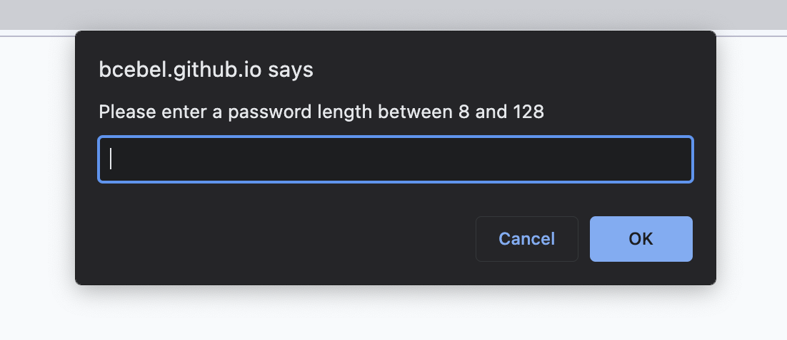
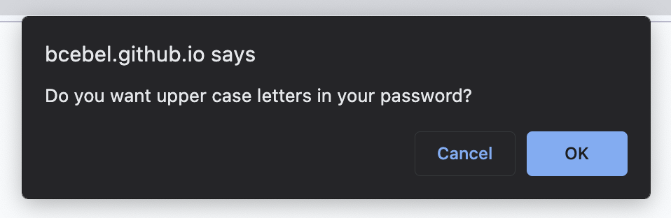
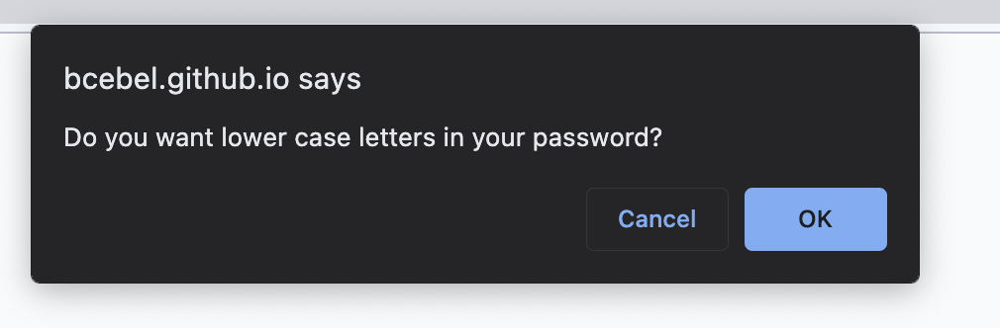
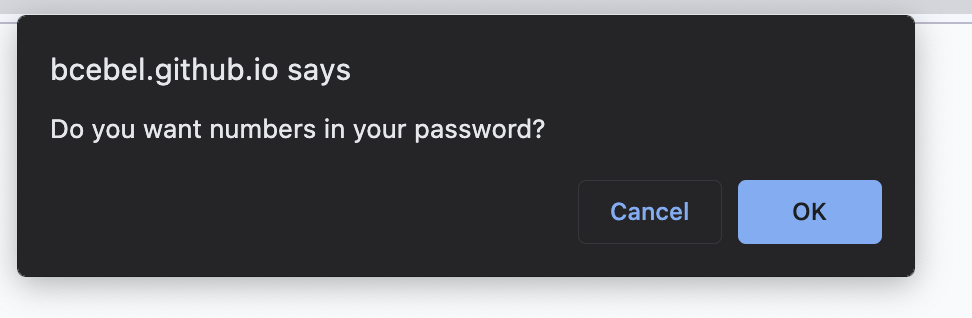
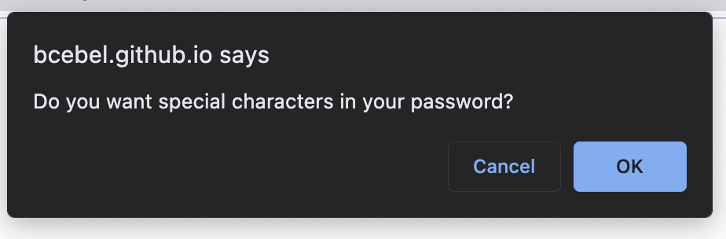
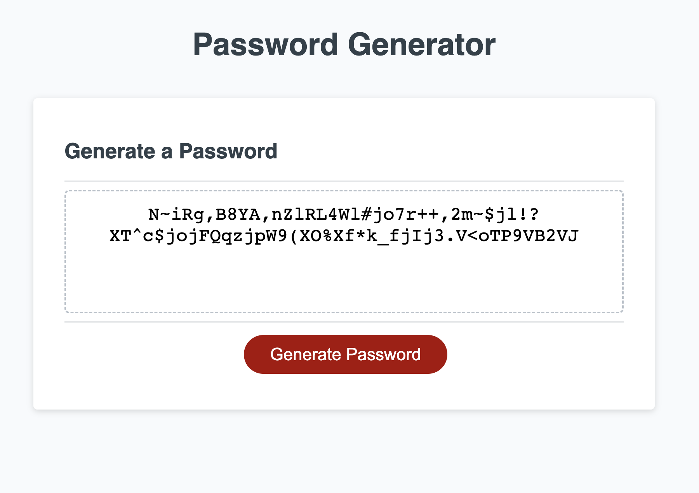

# PasswordGenerator

## Description
This is a password generator.  Click here to try it out!
https://bcebel.github.io/PasswordGenerator/

The parameters are: 8 to 128 characters using Uppercase, Lowercase, Numbers, and Special Characters.  You can select what you want your password to contain within those selections, just navigate the prompt buttons to narrow it down.  Once you see the "Generate Password" button go ahead and press it and your password will appear.  You can run it as many times as you would like to. 

I used string arrays for the text choices and added (concatenated) them  together and randomized the characters from there.  

Challenges were navigating the functions and printing to screen. 

## License 
MIT License, see repository for details. 

